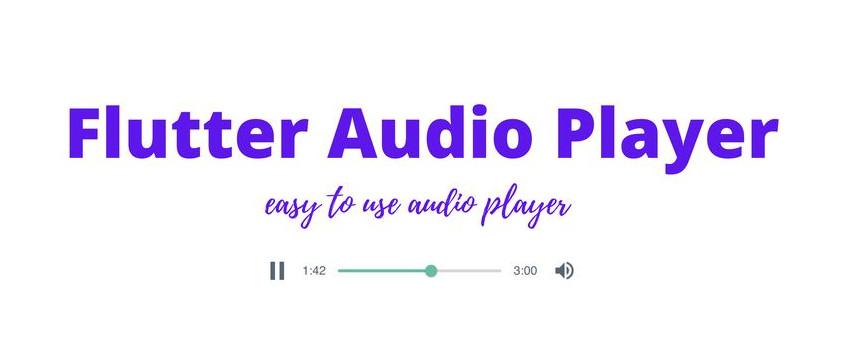

# Flutter Audio Player 

### audio player flutter package that provides an easy widgets to  have audio player that can play remote or local audio files across all platforms
#

## Secreenshots
 
<p float="left">
 
  
</p>
## Features
* easy to use audio players with background service using widgets:
  - MinimalAudioPlayer: just an audio player to play audio with no controles of on play & pause button .
  - BasicAudioPlayer: audio player with seekbar and controle buttons
  - FullAudioPlayer: audio player with all features seek bar , controles , playlist , and art image .

## Getting started
#
### 1. depend on it 
```yaml
dependencies:
  flutter:
    sdk: flutter
    # add this line 👇
  flutter_audio_player: {latest_version}
```
### 2. platform setup

### android setup

 after the 'manifest' tag and before the 'application' tag add these permissions .
 
 ```xml
    <!-- Just audio background PERMISSIONS -->
  <uses-permission android:name="android.permission.WAKE_LOCK"/>
  <uses-permission android:name="android.permission.FOREGROUND_SERVICE"/>
  
 ```

 then change the 'activity' tag 
 
 change this:

 ```xml
  android:name=".MainActivity"
 ```

 to this 
 ```xml
android:name="com.ryanheise.audioservice.AudioServiceActivity"
 ```

 then after 'activity' tag and before the end of 'application tag ' add this :

 ```xml
  <!--  ADD THIS "SERVICE" element -->
    <service android:name="com.ryanheise.audioservice.AudioService">
      <intent-filter>
        <action android:name="android.media.browse.MediaBrowserService" />
      </intent-filter>
    </service>

    <!-- ADD THIS "RECEIVER" element -->
    <receiver android:name="com.ryanheise.audioservice.MediaButtonReceiver" >
      <intent-filter>
        <action android:name="android.intent.action.MEDIA_BUTTON" />
      </intent-filter>
    </receiver> 
 ```

### IOS setup

Insert this in your Info.plist file:
```xml
	<key>UIBackgroundModes</key>
	<array>
		<string>audio</string>
	</array>
```

## Usage
#
1. call `initJustAudioBackground` as early as possible

```dart
void main() async {
  // init the background service to display notifications while playing
  await initJustAudioBackground(NotificationSettings(androidNotificationChannelId: 'com.example.example'));
  runApp(MaterialApp(
    home: HomeScreen(),
  ));
}
```

2. load your audios in a `ConcatenatingAudioSource` playlist containing an `AudioSource` or one of it's inherted classes .

```dart

  final ConcatenatingAudioSource _playlist = ConcatenatingAudioSource(children: [
    AudioSource.uri(Uri.parse('https://file-examples-com.github.io/uploads/2017/11/file_example_MP3_700KB.mp3'),
        tag: MediaItem(
            id: '1',
            artUri: Uri.parse('https://picsum.photos/300/300'),
            title: 'Audio Title ',
            album: 'amazing album'))
  ]);
```

3. call one of the players widgets with your playlist and options

```dart
return Scaffold(
        body: SafeArea(
            child: Padding(
                padding: const EdgeInsets.all(20.0),
                child: Center(
                  child: FullAudioPlayer(autoPlay: false, playlist: _playlist),
                ))));
```